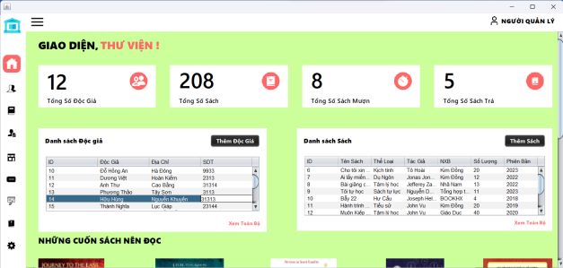

    <h1>Library Management System</h1>

## Introduction
The Library Management System is an application developed to help manage activities related to libraries, including managing books, users, and borrowing/returning transactions. Built using the Java programming language and supported by various frameworks, this system provides a user-friendly and efficient interface for both library managers and users.

## Key Features
- **Book Management**: Add, edit, and delete book information, including book title, author, genre, and status.
- **User Management**: Register, update, and delete user information.
- **Borrow/Return Management**: Track borrowing and returning transactions, including borrow date, due date, and book status.
- **Book Search**: Search for books by title, author, or genre.
- **Reporting**: Provide reports on the number of books, users, and borrowing/returning transactions.

## Technologies Used
- **Programming Language**:  Java
- **Framework & Libraries**:  JavaSwing, JDBC
- **Database**:  MySQL

## Installation
1. Clone this repository to your local machine:
 - git clone + link website project

2. Install MySQL and create a database according to the structure defined in the project.
3. Run the application using your preferred IDE (e.g., IntelliJ IDEA, Eclipse).

## Usage Instructions
1. Log in to the system using the administrator account.
2. Use the book, user, and transaction management features from the main menu.

## Some pictures of the project
*Because I am a Vietnamese student, the text and labels are mainly in Vietnamese, you can switch to English*

    
    
    
    
    
    
    
    
    
    
    
    

*Database images used MySQL, I saved in assets*

## Conclusion
The Library Management System is an exciting project that has helped me develop my programming and database management skills. I hope this application will be useful for those who want to manage a library effectively.